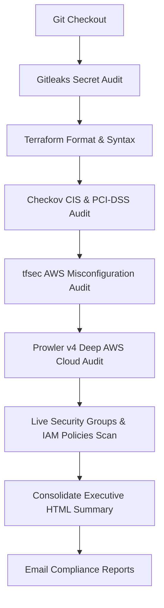

# SecDO: Automated DevSecOps CI/CD & Cloud Compliance Platform 🚀🛡️
## Comprehensive Project Presentation Deck

---

### 📊 Presentation Slide Structure Overview

| Slide # | Slide Title | Key Content Focus |
| :--- | :--- | :--- |
| **Slide 1** | Title & Project Executive Summary | Project Overview, Objectives, & Engineering Stack |
| **Slide 2** | Industry Challenge & DevSecOps Solution | Shift-Left Security, Keyless AWS IAM, Automated Auditing |
| **Slide 3** | AWS Infrastructure Architecture | Custom VPC, Subnets, EC2 Nodes, ALB, Private ECR |
| **Slide 4** | 12-Stage Main CI/CD Pipeline | Code Checkout to Production Deployment & DAST |
| **Slide 5** | SAST & Supply Chain Security | SonarQube Quality Gates, Aqua Trivy FS & Image Scans |
| **Slide 6** | Hardened Deployment & Swarm Cluster | PHP 8.3 Apache Non-Root, MariaDB 11, Docker Swarm |
| **Slide 7** | Deep Cloud Compliance Pipeline (`Jenkinsfile-ca`) | Gitleaks, Checkov CIS, tfsec, Prowler v4, IAM & Security Groups |
| **Slide 8** | Full Observability & Telemetry Suite | Prometheus, Grafana (`1860` & `14282`), cAdvisor, Node Exporter |
| **Slide 9** | Automated Team Notification System | Styled HTML Email Tables, Multi-Recipient Routing, 6 Attachments |
| **Slide 10** | Security Standards & Best Practices | Zero Hardcoded Keys, Least Privilege IAM, OWASP Top 10 |
| **Slide 11** | Live System Access Matrix | Live Public ALB URLs & Verification Endpoints |
| **Slide 12** | Project Conclusion & Q&A | Summary of Engineering Impact & Future Enhancements |

---

## 🎬 Slide-by-Slide Presentation Script & Visual Outline

---

### 🟢 SLIDE 1: Title & Executive Summary

**Slide Title**: **SecDO – Automated DevSecOps CI/CD & Cloud Compliance Platform**  
**Subtitle**: Enterprise-Grade Cloud Security, Continuous Integration, Observability, and Automated AWS Compliance  

**Key Talking Points**:
- **Project Name**: SecDO (Security & DevOps Orchestration)
- **Primary Objective**: Build an end-to-end automated pipeline that builds, scans, tests, deploys, monitors, and audits cloud infrastructure on AWS.
- **Core Technology Stack**: AWS (VPC, EC2, ECR, ALB, IAM), Jenkins 2.504, SonarQube, Aqua Trivy, Docker Swarm, OWASP ZAP, Prowler v4, Checkov, tfsec, Gitleaks, Prometheus, Grafana.

---

### 🟢 SLIDE 2: Industry Challenge & The DevSecOps Solution

**Slide Title**: **The Challenge vs. The SecDO Solution**  

#### 🔴 Industry Challenges in Cloud Deployments:
1. **Security Bottlenecks**: Security reviews conducted manually at the end of release cycles delay deployments.
2. **Hardcoded Credential Leaks**: High risk of AWS Secret Key leaks in repositories.
3. **Vulnerable Containers**: Untested Docker container layers deployed to production.
4. **Lack of Observability**: No real-time visibility into container memory spikes or CPU load.

#### 🟢 The SecDO Automated Solution:
1. **Shift-Left Security**: Security scanning (SAST, Supply Chain, IaC, DAST) embedded into every Git commit.
2. **Keyless AWS Security**: Uses AWS STS (`aws sts get-caller-identity`) and IAM Instance Profiles—Zero hardcoded access keys.
3. **Self-Healing Deployment**: Docker Swarm cluster with automated HTTP `/health.php` readiness probes.

---

### 🟢 SLIDE 3: System Architecture & AWS Topology

**Slide Title**: **Production AWS Infrastructure Topology**  

```
+---------------------------------------------------------------------------------------------------+
|                                 AWS Custom VPC (10.0.0.0/16) - ap-south-1                         |
|                                                                                                   |
|  +-------------------------------------------+   +---------------------------------------------+  |
|  |       Public Subnet 1a (10.0.10.0/24)     |   |       Public Subnet 1b (10.0.20.0/24)     |  |
|  |                                           |   |                                             |  |
|  |  +-------------------------------------+  |   |  +---------------------------------------+  |  |
|  |  |      Jenkins CI/CD EC2 Instance     |  |   |  |     Application & Monitoring Server   |  |  |
|  |  |  - Jenkins 2.504 (Port 8080)        |  |   |  |  - SecDO App Stack (PHP 8.3 Apache)  |  |  |
|  |  |  - SonarQube SAST (Port 9000)       |  |   |  |  - MariaDB 11 Database Engine        |  |  |
|  |  |  - Java 21, AWS CLI v2, Trivy     |  |   |  |  - Docker Swarm Cluster Node        |  |  |
|  |  |  - IAM Instance Profile Attached    |  |   |  |  - Prometheus (9090) / Grafana (3000)|  |  |
|  |  +-------------------------------------+  |   |  |  - cAdvisor (8081) / Node Exporter  |  |  |
|  |                                           |   |  +---------------------------------------+  |  |
|  +-------------------------------------------+   +---------------------------------------------+  |
|                        |                                                |                         |
|                        +-----------------------+------------------------+                         |
|                                                |                                                  |
|                        +-----------------------v------------------------+                         |
|                        |     AWS Application Load Balancer (ALB)        |                         |
|                        |   secdo-alb-124066993.ap-south-1.elb.amazonaws.com|                         |
|                        +------------------------------------------------+                         |
+---------------------------------------------------------------------------------------------------+
```

---

### 🟢 SLIDE 4: End-to-End DevSecOps CI/CD Pipeline (12 Stages)

**Slide Title**: **12 Automated Application Pipeline Stages (`Jenkinsfile`)**  

```mermaid
flowchart LR
    S1[1. Checkout] --> S2[2. Syntax Validation]
    S2 --> S3[3. SonarQube SAST]
    S3 --> S4[4. Quality Gate]
    S4 --> S5[5. Trivy FS Scan]
    S5 --> S6[6. Docker Build]
    S6 --> S7[7. Trivy Image Scan]
    S7 --> S8[8. AWS ECR Push]
    S8 --> S9[9. Swarm Deploy]
    S9 --> S10[10. Health Probe]
    S10 --> S11[11. OWASP ZAP DAST]
    S11 --> S12[12. Email Reports]
```



**Key Highlights**:
- Triggered automatically via **GitHub Webhook Push**.
- Automated validation at every single stage before proceeding.

---

### 🟢 SLIDE 5: Static Security & Supply Chain Defense

**Slide Title**: **SAST, Quality Gates & Supply Chain Auditing**  

1. **SonarQube Static Application Security Testing (SAST)**:
   - Scans PHP backend code for SQL Injection, XSS, and unhandled exceptions.
   - Evaluates SonarQube Quality Gates before approving code for build.
2. **Aqua Trivy Filesystem Scan**:
   - Scans third-party libraries, dependencies, and filesystem configurations for CVE vulnerabilities.
3. **Aqua Trivy Container Image Scan**:
   - Audits container layers (`php:8.3-apache`) for HIGH and CRITICAL vulnerabilities prior to ECR upload.

---

### 🟢 SLIDE 6: Production Container Hardening & Swarm Cluster

**Slide Title**: **Container Hardening & Swarm Self-Healing**  

1. **Multi-Stage Container Hardening**:
   - Built on PHP 8.3 Apache.
   - Drops root privileges—Executes under unprivileged `www-data` user.
   - Suppresses Apache Server Signature (`ServerTokens ProductOnly`).
2. **MariaDB 11 Database Engine**:
   - Self-healing database auto-migration (`CREATE TABLE IF NOT EXISTS`).
3. **Docker Swarm Zero-Downtime Deployment**:
   - Polls `/health.php` probe endpoint up to 15 retries (HTTP 200 OK).

---

### 🟢 SLIDE 7: Deep AWS Infrastructure Compliance Audit Pipeline (`Jenkinsfile-ca`)

**Slide Title**: **Cloud Security Posture Management & Compliance Pipeline**  



**Compliance Frameworks Audited**:
- **CIS AWS Foundations Benchmark v3.0**
- **PCI-DSS & HIPAA IaC Standards**
- **AWS Security Best Practices & IAM Least-Privilege**

---

### 🟢 SLIDE 8: Real-Time Observability & Telemetry Suite

**Slide Title**: **Full Stack Observability: Prometheus + Grafana**  

#### Telemetry Components Installed on Application Host (`10.0.20.60`):
1. **Prometheus (`Port 9090`)**: Scrapes metrics every 15 seconds.
2. **Grafana (`Port 3000`)**: Visualizes real-time host and container performance.
   - **Dashboard `1860`**: Node Exporter Full (Host CPU %, RAM Memory, Disk I/O, Network MB/s).
   - **Dashboard `14282`**: cAdvisor Container Performance (Per-container CPU & Memory).
3. **cAdvisor (`Port 8081`)**: Real-time container runtime inspection.
4. **Node Exporter (`Port 9100`)**: Hardware & OS telemetry agent.

---

### 🟢 SLIDE 9: Automated Team Email Notification System

**Slide Title**: **Multi-Recipient Notification & Executive Attachments**  

- **Sender**: `patilrahulprafulla@gmail.com`
- **Recipients**: All 4 Team Members (`patilrahulprafulla1@gmail.com`, `dangerushi19@gmail.com`, `ameybhalerao004@gmail.com`, `ashutoshkabade1961@gmail.com`).
- **Rich HTML Content**: Embedded CSS tables showing Project Metadata, Branch, Live Links, and Stage Summaries.
- **6 Attached Compliance Audit Reports**:
  1. 📄 `gitleaks-report.json`
  2. 📄 `checkov-report.json`
  3. 📄 `tfsec-report.json`
  4. 📄 `prowler-report.html`
  5. 📄 `aws-live-audit.txt`
  6. 📄 `aws-compliance-summary.html`

---

### 🟢 SLIDE 10: Security Best Practices & Controls Implemented

**Slide Title**: **Enterprise Compliance & Security Standards**  

| Security Domain | Implementation Control | Security Impact |
| :--- | :--- | :--- |
| **AWS Authentication** | IAM Instance Profiles & STS Tokens | 100% Zero Hardcoded AWS Access Keys |
| **Code Security** | SonarQube SAST + Quality Gate | Prevents SQLi, XSS, & Code Smells |
| **Supply Chain** | Aqua Trivy FS & Image Scanner | Blocks High/Critical CVE Layer Flaws |
| **Cloud Posture** | Checkov + Prowler v4 + tfsec | Enforces CIS AWS Foundations v3.0 |
| **Secret Protection** | Gitleaks Repository Scanner | Prevents API key leaks in git commits |
| **Application Hardening** | OWASP ZAP Baseline DAST | Audits HTTP headers & X-Frame options |

---

### 🟢 SLIDE 11: Live System Access Matrix

**Slide Title**: **Live Infrastructure Access Endpoints**  

| Service | Live Access URL | Credentials / Notes |
| :--- | :--- | :--- |
| **Production Web App** | `http://secdo-alb-124066993.ap-south-1.elb.amazonaws.com` | Live Production App |
| **Health Check API** | `http://secdo-alb-124066993.ap-south-1.elb.amazonaws.com/health.php` | HTTP 200 OK Probe |
| **Jenkins CI/CD Server** | `http://secdo-alb-124066993.ap-south-1.elb.amazonaws.com:8080` | `admin` / `Sunbeam@2002` |
| **SonarQube SAST** | `http://secdo-alb-124066993.ap-south-1.elb.amazonaws.com:9000` | `admin` / `admin` |
| **Grafana Dashboards** | `http://secdo-alb-124066993.ap-south-1.elb.amazonaws.com:3000` | `admin` / `admin_secdo_monitoring` |
| **Prometheus Telemetry** | `http://secdo-alb-124066993.ap-south-1.elb.amazonaws.com:9090` | Public Access |
| **cAdvisor Container Engine** | `http://secdo-alb-124066993.ap-south-1.elb.amazonaws.com:8081` | Public Access |

---

### 🟢 SLIDE 12: Conclusion & Strategic Roadmap

**Slide Title**: **Conclusion & Future Enhancements**  

#### 🏆 Key Achievements:
- Successfully built and deployed a 100% automated DevSecOps CI/CD Pipeline.
- Achieved keyless AWS security with IAM Instance Profiles.
- Established real-time observability and continuous AWS cloud compliance auditing.

#### 🚀 Future Strategic Enhancements:
- **AWS Security Hub & GuardDuty Integration**: Centralized AI threat intelligence.
- **Sysdig Falco Container Runtime Security**: Kernel-level zero-day threat prevention.
- **Software Bill of Materials (SBOM) & Cosign**: Cryptographic container signing.

---

### ❓ Questions & Answers (Q&A)

**Thank You!**  
*SecDO Cloud Security & DevSecOps Engineering Team*
